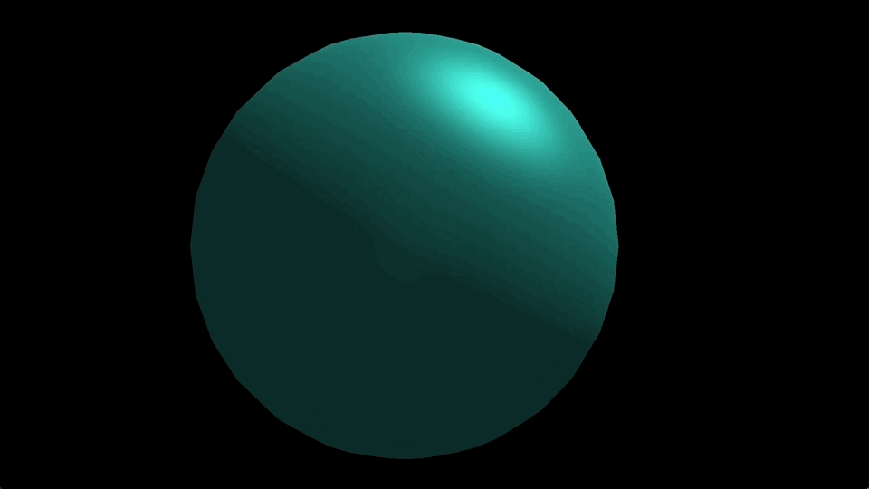
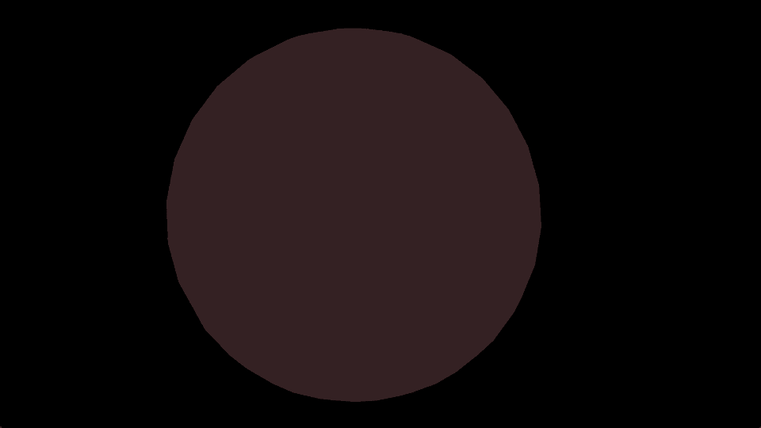
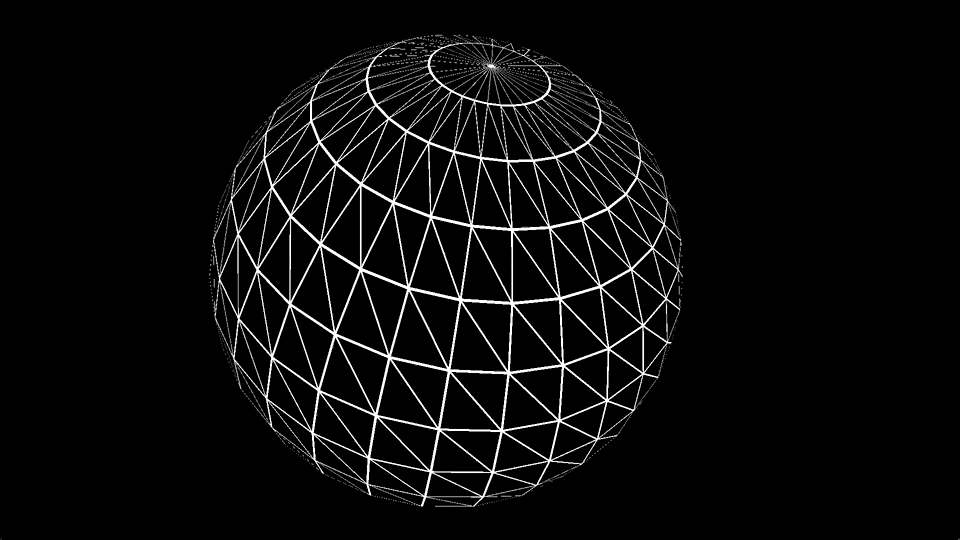
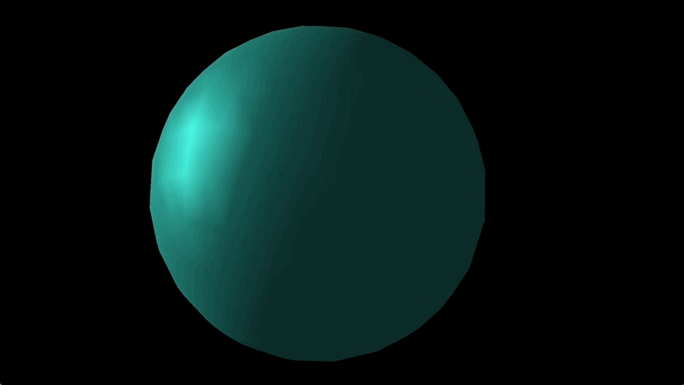
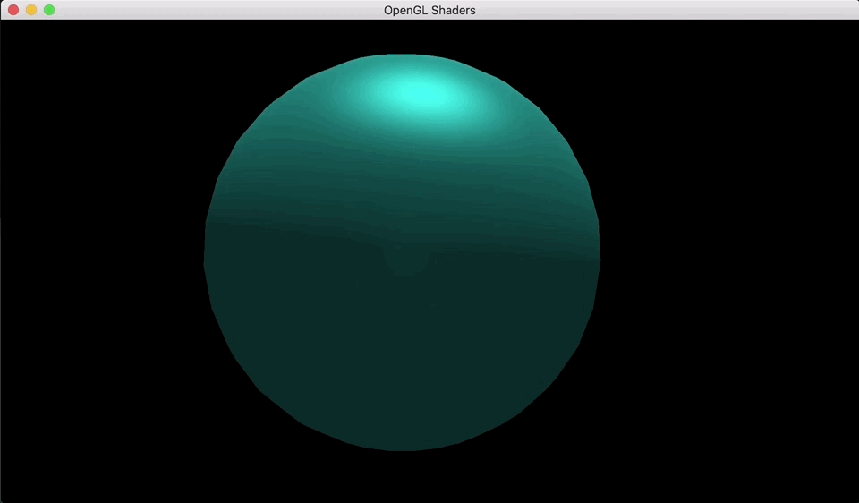
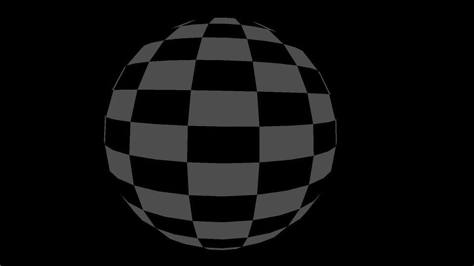
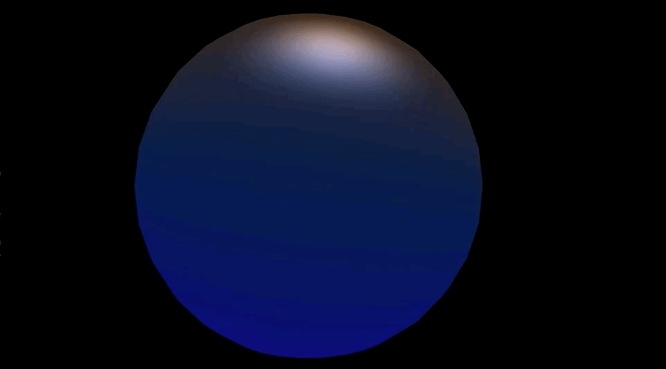

# OpenGL Shaders

## Overview
This program loads an OBJ file of a 3D model and allows the user to translate, rotate and scale the model. In addition, the shader used to render the object can be changed during runtime.

Here is a list of the shaders that are currently included in this program.
- [Skeleton Shader](#skeleton-shader)
- [Wireframe Shader](#wireframe-shader)
- [Gouraud Shader](#gouraud-shader)
- [Blinn-Phong Shader](#blinn-phong-shader)
- [Texture Mapped Shader](#texture-mapped-shader)
- [Normal Mapped Shader](#normal-mapped-shader)
- [Checkerboard Shader](#checkerboard-shader)
- [Cross-hatching Shader](#cross-hatching-shader)
- [Cel Shader](#cel-shader)
- [Gooch Shader](#gooch-shader)

## Demo



## Usage
To run the program, run the following command from inside the project directory (or you can use `ant run`).
```
$ ant
```

### Controls

You can use the following keys to manipulate the mesh.

| Key | Action                                                |
|-----|-------------------------------------------------------|
| Q   | Select next GameObject                                |
| W   | Select previous GameObject                            |
| E   | Scale current GameObject up                           |
| R   | Scale current GameObject down                         |
| T   | Translate current GameObject right                    |
| Y   | Translate current GameObject left                     |
| U   | Translate current GameObject up                       |
| I   | Translate current GameObject down                     |
| O   | Translate current GameObject forward                  |
| P   | Translate current GameObject backward                 |
| A   | Rotate current GameObject positively about the x-axis |
| S   | Rotate current GameObject negatively about the x-axis |
| D   | Rotate current GameObject positively about the y-axis |
| F   | Rotate current GameObject negatively about the y-axis |
| G   | Rotate current GameObject positively about the z-axis |
| H   | Rotate current GameObject negatively about the z-axis |
| Space   | Toggle through the shaders |
| 0   | Translate the current GameObject's mesh               |
| 1   | Take a screenshot                                     |
| 3   | Enable the first shader				      |
| 4   | Enable the second shader			      |
| 5   | Enable the third shader				      |
| 7   | Reflect the current GameObject's mesh                 |
| 8   | Scale the current GameObject's mesh                   |
| 9   | Rotate the current GameObject's mesh                  |

## Shaders
### Skeleton Shader
A simple, flat shader that adds a reddish-tint uniformly to the mesh and only takes into consideration ambient lighting.


### Wireframe Shader
Renders the wireframe of the object--edges of each triangle in the mesh are highlighted in white, while all other faces black.



This shader was done by assigning barycentric coordinates in the geometry shader to each vertex of the triangle primitive. Then the fragment shader assigns a color (black / white) based on the barycentric coordinate.

### Gouraud Shader
See detailed information [here](https://en.wikipedia.org/wiki/Gouraud_shading).

Ambient, diffuse and specular lighting are computed per vertex in the vertex shader. This leads to more artifacting and gives objects a faceted look due to linear interpolation of lighting intensity throughout each triangle primitive.



### Blinn-Phong Shader
See Wikipedia entry [here](https://en.wikipedia.org/wiki/Blinn%E2%80%93Phong_shading_model) for more details.

Similar to the [Gouraud Shader](#gouraud-shader), the Blinn-Phong shader computes ambient, diffuse and specular lighting. However, this computation occurs __per fragment__ in the fragment shader, which fixes the artifacts seen in the Gouraud shader.



### Texture Mapped Shader
Renders a Minecraft grass block.

Given a texture and a cube model with appropriate UV texture mapping, the RGB values from the texture can trivially be applied to the model to generate this Minecraft block.


### Normal Mapped Shader
Renders a cube with a brick texture.

Rather than using the RGB values from the texture, the normals of each fragment can be modified using a normal map. [Here](https://learnopengl.com/Advanced-Lighting/Normal-Mapping) is an article that clearly explains this.


### Checkerboard Shader
Procedurally-generated a checkerboard pattern using the model's texture coordinates and applied it to the mesh.



### Cross-hatching Shader
Hatching is an drawing technique that is fully explained [here](https://en.wikipedia.org/wiki/Hatching).

Using [this](https://www.eecs.yorku.ca/course_archive/2011-12/W/4431/lectures/Day20.pptx) resource, it is quite simple to create a shader that gives each mesh a Hatching-esque appearance.


### Cel Shader
Cel shading (or Toon shading) is covered in [this](https://en.wikipedia.org/wiki/Cel_shading) Wikipedia entry.

This shading technique makes objects look cartoon-like and is used in games like *Ookami* and *The Legend of Zelda: Breath of the Wild*.


### Gooch Shader
Gooch shading is a non-photorealistic rendering method developed by Amy Gooch at the University of Utah. More information about the shader can be found [here](https://en.wikipedia.org/wiki/Gooch_shading).

Object fragments whose normals point away from the light source receive a cool color shading, while fragments whose normals point in the same direction as the light source receive a warm color shading.

**Note**: I used [this](https://www.eecs.yorku.ca/course_archive/2011-12/W/4431/lectures/Day20.pptx) resource for creating the Gooch shader.



## References
- For wireframe: [http://codeflow.org/entries/2012/aug/02/easy-wireframe-display-with-barycentric-coordinates/](http://codeflow.org/entries/2012/aug/02/easy-wireframe-display-with-barycentric-coordinates/)
- For normal mapping: [https://learnopengl.com/Advanced-Lighting/Normal-Mapping](https://learnopengl.com/Advanced-Lighting/Normal-Mapping)
- For cel shading: [http://www.lighthouse3d.com/tutorials/glsl-12-tutorial/toon-shader-version-ii/](http://www.lighthouse3d.com/tutorials/glsl-12-tutorial/toon-shader-version-ii/)
- For hatching and gooch: [https://www.eecs.yorku.ca/course_archive/2011-12/W/4431/lectures/Day20.pptx](https://www.eecs.yorku.ca/course_archive/2011-12/W/4431/lectures/Day20.pptx)
